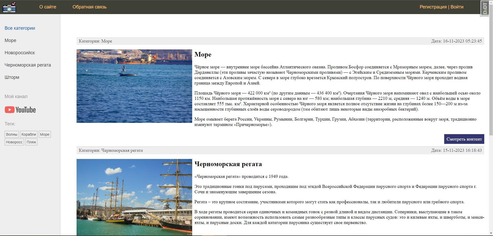

# **"Web-приложение myphotos"**

Настоящий сайт состоит из авторских фотографий и текстового описания к ним.
***



## Установка
Создайте и активируйте виртуальное окружение:

```
poetry shell
```

Установить определенные зависимости для проекта перечисленные
в pyproject.toml файле:
```
poetry install
```
***

## Запуск
Находясь в папке проекта myphotos/, запустите тестовый сервер с приложением:

```commandline
python manage.py runserver
```